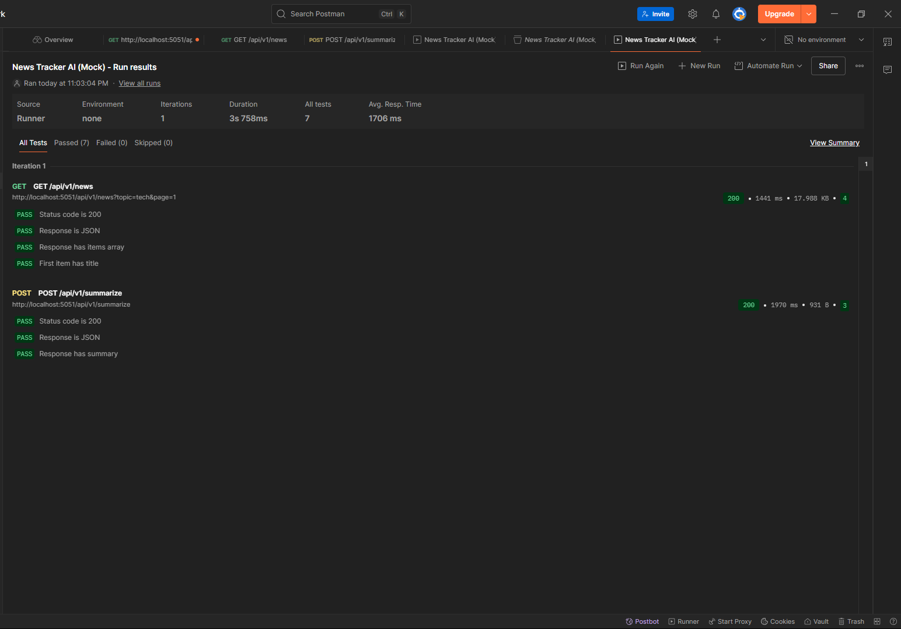

# 📖 News Tracker AI

[](https://nodejs.org) 
[](https://expressjs.com)
[](https://www.postman.com)

## 📌 Introduction
**News Tracker AI** is a demo backend project built with **Node.js + Express**, designed to:
- Fetch & normalize news from multiple RSS sources.  
- Apply temporary caching & pagination.  
- Integrate **AI-powered summarization** and (future) recommendations.  

👉 This project is part of a **showcase portfolio**.

---

## 🚀 Development – Backend

### Setup
1. Clone repo:
   ```bash
   git clone https://github.com/<username>/news-tracker-ai.git
   cd news-tracker-ai/server
````

2. Copy `.env.example` → `.env` and configure variables.

3. Install dependencies and run:

   ```bash
   npm install
   npm run dev
   ```

4. API will run at:

   ```
   http://localhost:5051/api/v1
   ```

---

## 📂 Project Structure

```
/server        → Express backend
/docs          → API contract & slices
/docs/postman  → Postman collection + test evidence
/client        → Mock frontend (optional demo)
```

---

## 📡 Available Endpoints

### Slice 1 – News Feed (✅ Done)

* `GET /api/v1/health`
* `GET /api/v1/news?topic=tech&page=1[&forceRefresh=1]`

➡️ Details: [`docs/api-slice-1-news.md`](docs/api-slice-1-news.md)

---

### Slice 2 – Summarize (✅ Done)

* `POST /api/v1/summarize`
* Summarizes input text using AI (with cache + rate limiting).

➡️ Details: [`docs/api-slice-2-summarize.md`](docs/api-slice-2-summarize.md)

---

### Slice 3 – Recommend (🔜 Planned)

* `POST /api/v1/recommend`
* Suggest actions based on a given summary.

---

## 📝 API Contract

See full API contract: [`docs/api-contract.md`](docs/api-contract.md)

---

## 🧪 Testing

✅ Postman tests included:

* `GET /news` (status, JSON, items, pagination, cache)
* `POST /summarize` (status, JSON, summary field)

Run evidence: [`docs/postman/news-tracker-ai_test_run.json`](docs/postman/news-tracker-ai_test_run.json)



### Run tests via CLI (Newman)

```bash
npm install -g newman
newman run docs/postman/news-tracker-ai_collection.json \
  --reporters cli,json \
  --reporter-json-export docs/postman/news-tracker-ai_newman_result.json
```

---

## ⚙️ Environment Variables

```env
PORT=5051
NEWS_PAGE_SIZE=30
NEWS_CACHE_TTL=300

AI_PROVIDER=openai|mock
AI_MODEL=gpt-4o-mini
AI_API_KEY=sk-xxxx

SUMMARIZE_CACHE_TTL=86400
AI_RATE_MAX=5
AI_RATE_WINDOW_MS=60000
MAX_SUMMARY_INPUT_CHARS=8000
DEFAULT_SUMMARY_MODE=bullets
DEFAULT_SUMMARY_LANG=en
```

---

## 🖥 Development – Frontend (mock client)

```bash
npx json-server --watch db.json --port 5050
```

Open `client/src/index.html` with Live Server for mock demo.

---

## 🗺 Roadmap

* ✅ Slice 1: News Feed (no AI)
* ✅ Slice 2: Summarize API (AI text summarization)
* 🔜 Slice 3: Recommend API
* 🔜 Slice 4: Local state persistence
* 🔜 Deployment + CI tests

---

## 📸 Screenshots

### Sample `/news` response


### Postman Test Evidence


---

## 📜 License
This project is licensed under the MIT License - see the [LICENSE](LICENSE) file for details.
