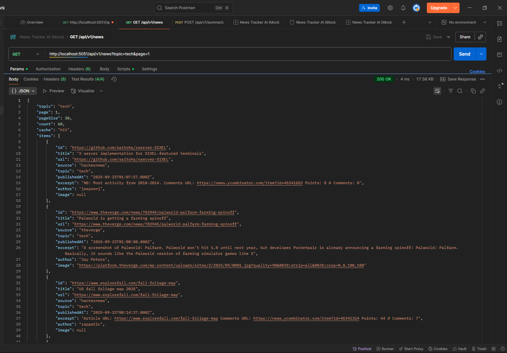

# News Tracker AI

[](https://nodejs.org)
[](https://expressjs.com)
[](docs/postman/news-tracker-ai_collection.json)
[](https://platform.openai.com)
[](https://github.com/tranbaokien2005/news-tracker-ai/actions/workflows/ci.yml)


## Introduction

**News Tracker AI** is a backend showcase project built with **Node.js + Express**, designed to:

* Fetch & normalize news from multiple RSS sources.
* Apply caching & pagination for efficiency.
* Integrate **AI-powered summarization** (done) and recommendations (planned).

This project is part of a **personal portfolio**.

---

## Table of Contents

* [Getting Started](#getting-started)
* [Project Structure](#project-structure)
* [API Endpoints](#api-endpoints)
* [API Contract](#api-contract)
* [Testing](#testing)
* [Environment Variables](#environment-variables)
* [Frontend (Mock Client)](#frontend-mock-client)
* [Screenshots & Demo](#screenshots--demo)
* [Roadmap](#roadmap)
* [Showcase Case Study](#showcase-case-study)
* [Author](#author)
* [License](#license)

---

## Getting Started

```bash
# Clone repo
git clone https://github.com/<username>/news-tracker-ai.git
cd news-tracker-ai/server

# Copy env file and configure
cp .env.example .env

# Install dependencies
npm install

# Run dev server
npm run dev
```

API available at:

```
http://localhost:5051/api/v1
```

---

## Project Structure

```
/server        → Express backend
/docs          → API contract & slice docs
/docs/postman  → Postman collection + test results
/client        → Mock frontend (optional demo)
```

---

## API Endpoints

### Slice 1 – News Feed 

* `GET /api/v1/health`
* `GET /api/v1/news?topic=tech&page=1[&forceRefresh=1]`
  Details: [`docs/api-slice-1-news.md`](docs/api-slice-1-news.md)

### Slice 2 – Summarize 

* `POST /api/v1/summarize` → Summarizes input text using AI (with cache + rate limiting).
  Details: [`docs/api-slice-2-summarize.md`](docs/api-slice-2-summarize.md)

### Slice 3 – Recommend (Planned)

* `POST /api/v1/recommend` → Suggests actions based on summaries.

---

## API Contract

See full spec: [`docs/api-contract.md`](docs/api-contract.md)

---

## Testing

Postman tests included:

* `GET /news` → status, JSON, pagination, cache hit/miss
* `POST /summarize` → validates summary output

Collection: [`docs/postman/news-tracker-ai_collection.json`](docs/postman/news-tracker-ai_collection.json)
Test evidence: [`docs/postman/news-tracker-ai_test_run.json`](docs/postman/news-tracker-ai_test_run.json)


### Run via Newman (CLI)

```bash
npm install -g newman
newman run docs/postman/news-tracker-ai_collection.json \
  --reporters cli,json \
  --reporter-json-export docs/postman/news-tracker-ai_newman_result.json
```

---

## Environment Variables

```env
PORT=5051
NEWS_PAGE_SIZE=30
NEWS_CACHE_TTL=300

AI_PROVIDER=openai|mock
AI_MODEL=gpt-4o-mini
AI_API_KEY=sk-xxxx

SUMMARIZE_CACHE_TTL=86400
AI_RATE_MAX=5
AI_RATE_WINDOW_MS=60000
MAX_SUMMARY_INPUT_CHARS=8000
DEFAULT_SUMMARY_MODE=bullets
DEFAULT_SUMMARY_LANG=en
```

---

## Frontend (Mock Client)

```bash
npx json-server --watch db.json --port 5050
```

Open `client/src/index.html` with Live Server for mock demo.

---

## Screenshots & Demo

### Sample `/news` Response



### Postman Tests


### Demo (GIF)


---

## Roadmap

* Slice 1: News Feed
* Slice 2: Summarize API
* Slice 3: Recommend API (planned)
* Slice 4: Local state persistence (planned)
---

## Showcase Case Study

Detailed explanation:
[Why Cache and Rate-Limit Matter (Case Study)](docs/showcase-cache-rate-limit.md)

---

## Author

* **Name**: Tran Bao Kien
* **GitHub**: [tranbaokien2005](https://github.com/tranbaokien2005)  
* **LinkedIn**: [linkedin.com/in/tranbaokien2005](https://www.linkedin.com/in/tranbaokien2005)  
* **Email**: [tranbaokien.2005@gmail.com](mailto:tranbaokien.2005@gmail.com)  


---

## License

MIT License – see [LICENSE](LICENSE) for details.

---

